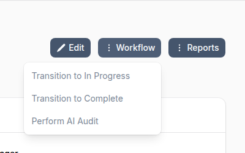
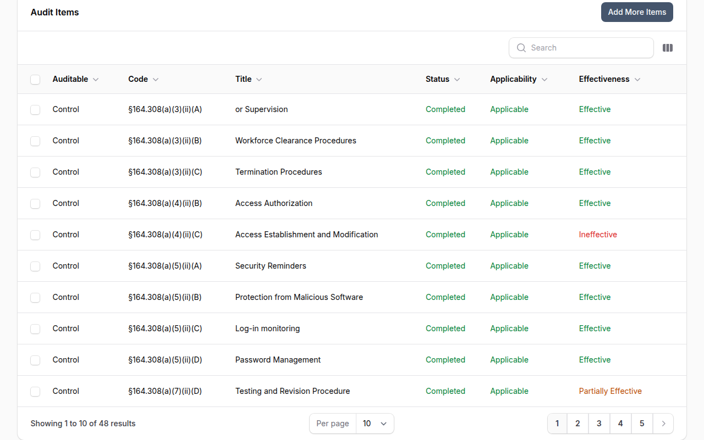
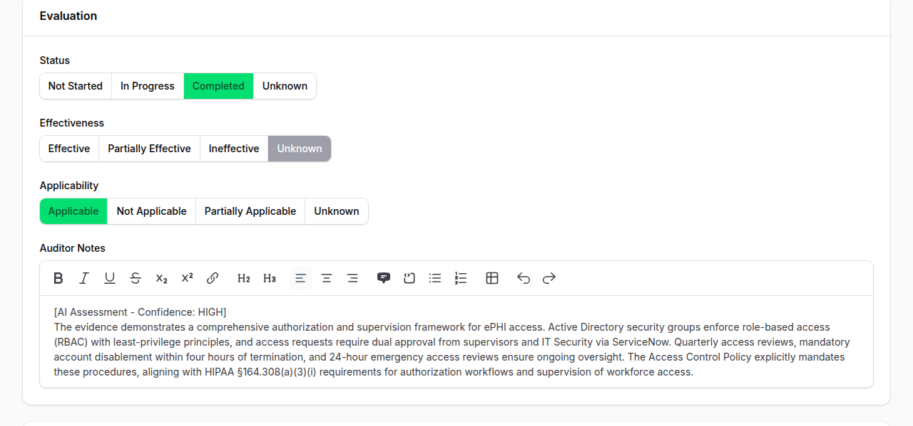

# AI-Powered Audits

!!! enterprise "Enterprise Feature"
    AI-Powered Audits are available exclusively in OpenGRC Enterprise. [Learn more about Enterprise](https://opengrc.com).

OpenGRC Enterprise extends the built-in [Audit framework](../foundations/audits.md) with AI-powered automated assessments. With a single click, AI evaluates every control in your audit against your organization's documented implementations and policies -- producing effectiveness ratings, applicability determinations, and detailed auditor notes.

## Overview

AI-Powered Audits help organizations:

- Perform rapid gap assessments across entire compliance frameworks
- Get preliminary control assessments when time is limited
- Establish a baseline before manual review
- Identify controls that need human attention (flagged for review)
- Assess dozens or hundreds of controls in minutes instead of days

## How It Works

### Launching an AI Audit

1. Navigate to an audit that is **In Progress**
2. Click the **Workflow** button in the header
3. Select **Perform AI Audit**

A confirmation dialog shows the estimated processing time (approximately 1 minute per audit item) and notes that the AI assesses implementations and policies -- not attached evidence files.

### What the AI Evaluates

For each control-based audit item, the AI:

1. **Gathers evidence** -- Reads the control's title, description, discussion, and test procedures
2. **Reviews implementations** -- Examines all implementations linked to the control, including their status and details
3. **Searches policies** -- Finds relevant policies and procedures by searching document content
4. **Scores the control** -- Determines effectiveness based on implementation coverage
5. **Writes auditor notes** -- Documents the rationale, including confidence level and whether human review is recommended

### Assessment Results

After processing, each audit item is updated with:

| Field | Description |
|-------|-------------|
| **Status** | Set to Completed |
| **Effectiveness** | Effective, Partially Effective, or Not Effective |
| **Applicability** | Whether the control applies to the organization |
| **Auditor Notes** | AI rationale with confidence level (HIGH/MEDIUM/LOW) and human review flag |

### Reviewing an AI-Assessed Item

Each audit item can be opened for review. The evaluation section shows the status, effectiveness, and applicability toggles set by the AI, along with detailed auditor notes explaining the rationale.

The auditor notes begin with an `[AI Assessment - Confidence: HIGH]` tag followed by a detailed explanation of how the AI reached its conclusion, referencing specific implementations and policies. You can edit any field before saving.

### Effectiveness Scoring

The AI considers implementation status and effectiveness when scoring:

| Implementation Status | Credit |
|----------------------|--------|
| **Implemented** | Full credit |
| **Partially Implemented** | 50% credit |
| **Not Implemented** | No credit |

Policies alone can reduce risk by a maximum of 1 point -- operational implementations are required for full effectiveness credit.

### Confidence Levels

Each assessment includes a confidence indicator:

| Confidence | Meaning |
|------------|---------|
| **HIGH** | Strong evidence from multiple implementations and policies |
| **MEDIUM** | Some evidence found but gaps exist |
| **LOW** | Minimal evidence -- flagged for human review |

Items assessed with LOW confidence are automatically flagged with "Needs Human Review" in the auditor notes.

## Progress Tracking

During processing, a live progress widget shows:

- Number of items assessed out of total
- Currently processing control codes
- Failed item count (if any)
- Auto-refreshes every 5 seconds

When the AI audit completes, you receive an in-app notification with a link back to the audit.

## When to Use AI Audits

| Scenario | AI Audit Value |
|----------|---------------|
| **Gap assessment** | Quickly identify which controls lack implementations |
| **Pre-audit baseline** | Get a starting point before manual review |
| **Time-constrained review** | Assess controls when a full manual audit isn't feasible |
| **Framework onboarding** | Evaluate readiness against a new compliance standard |
| **Continuous monitoring** | Run periodic checks between formal audits |

## Limitations

- AI assesses **implementations and policies only** -- it does not review attached evidence files (screenshots, logs, exports)
- Results should be treated as **preliminary assessments** -- human review is recommended for compliance-critical audits
- Only **control-based audit items** are assessed (implementation-only items are skipped)
- The audit must be **In Progress** and you must be the audit **Manager** to launch an AI audit

## Best Practices

- **Review LOW confidence items first** -- These are the controls most likely to need manual attention
- **Use AI audit as a starting point** -- Review and adjust the AI's findings rather than submitting them as-is
- **Ensure implementations are documented** -- The AI's accuracy depends on having detailed implementation records
- **Link policies to controls** -- The more policies linked to your controls, the better the AI can assess coverage
- **Run before manual audit** -- Use the AI assessment to prioritize which controls need the most attention during your manual review

!!! warning "AI Usage Quota"
    AI audits consume AI tokens for each audit item processed. Token usage counts against your organization's AI quota. Monitor usage in **Settings > AI**.
