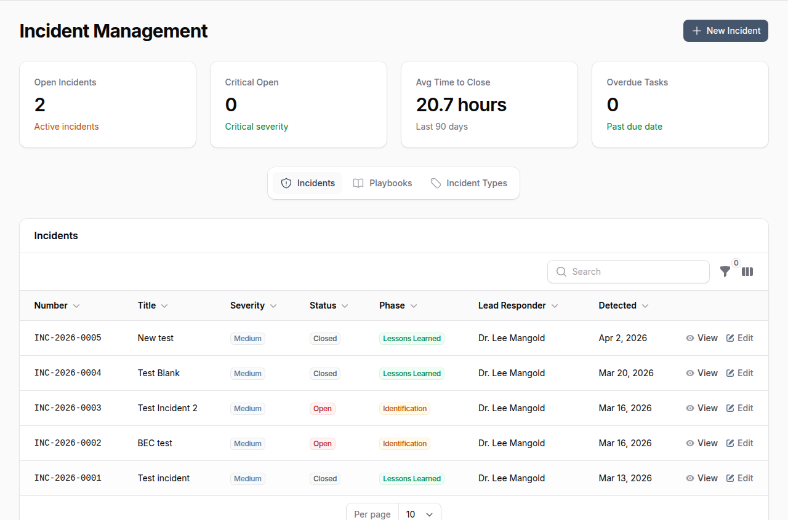
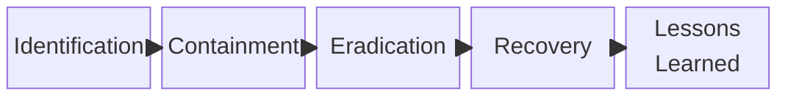
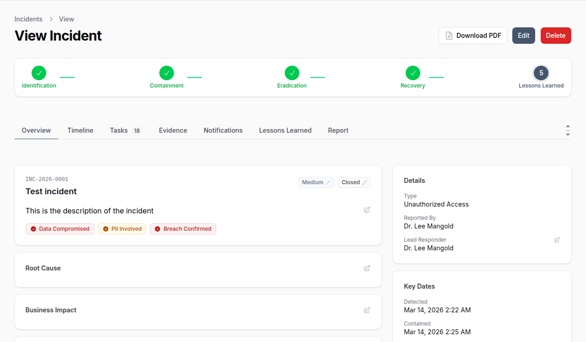
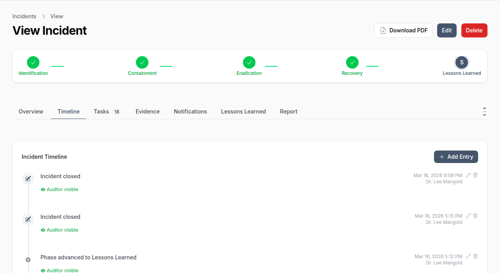
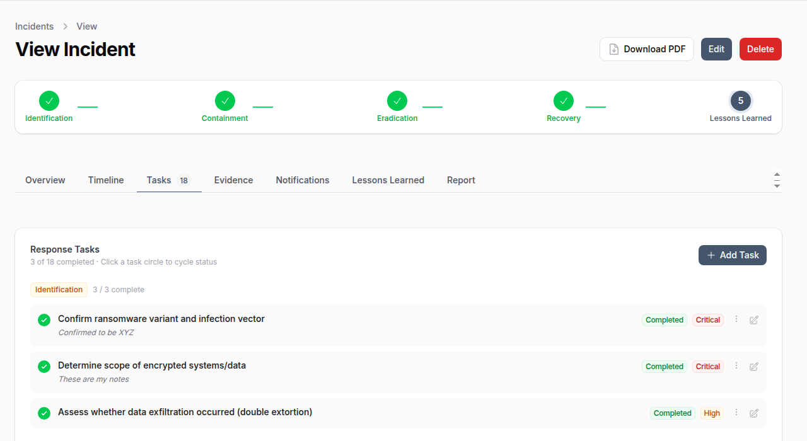
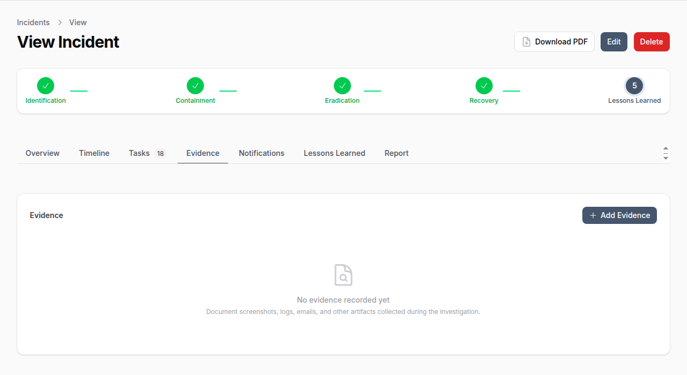
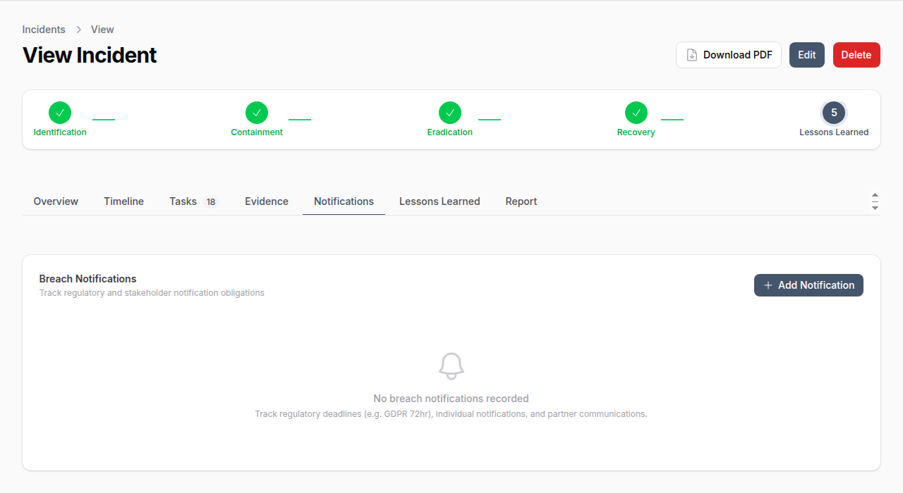
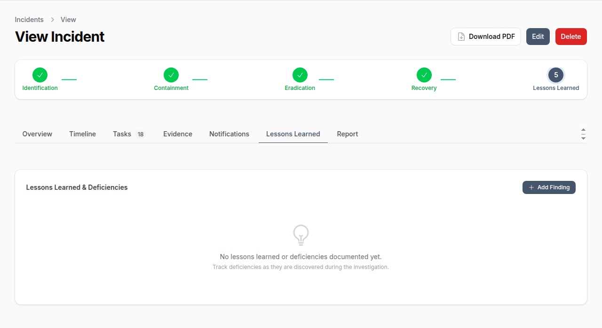
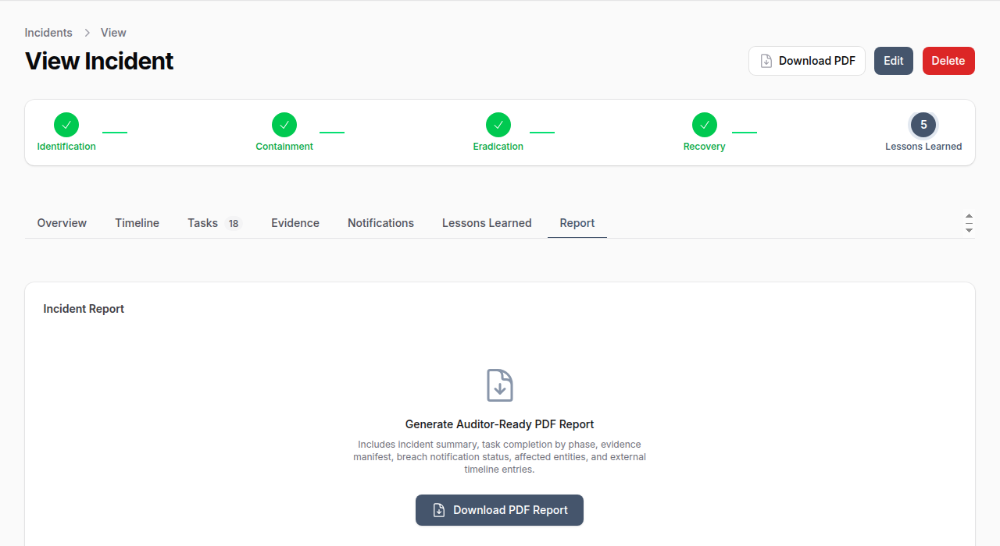
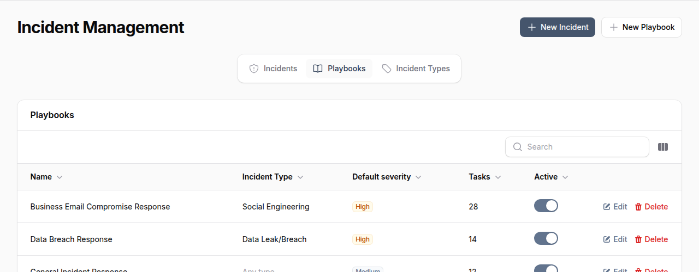

# Incident Management

!!! enterprise "Enterprise Feature"
    Incident Management is available exclusively in OpenGRC Enterprise. [Learn more about Enterprise](https://opengrc.com).

OpenGRC Incident Management provides a complete incident response tracking and documentation platform. Based on the SANS 6-phase incident response model, it guides teams through identification, containment, eradication, recovery, and lessons learned -- with built-in evidence collection, breach notification tracking, playbook automation, and auditor-ready reporting.

## Overview

Incident Management helps organizations:

- Track security incidents through a structured response lifecycle
- Execute response playbooks with pre-defined tasks per phase
- Collect and preserve digital evidence with chain of custody
- Track breach notification deadlines and regulatory obligations
- Document a full incident timeline for auditors and regulators
- Generate PDF incident reports
- Link incidents to affected assets, applications, vendors, and controls

The dashboard displays key metrics: open incidents, critical severity count, average time to close, and overdue tasks.

## Incident Response Lifecycle

Incidents follow the SANS 6-phase model. The phase progress bar at the top of each incident tracks advancement through the lifecycle.

| Phase | Purpose |
|-------|---------|
| **Identification** | Detect and confirm the incident, assign a lead responder |
| **Containment** | Stop the spread and limit damage |
| **Eradication** | Remove the threat from the environment |
| **Recovery** | Restore systems to normal operation |
| **Lessons Learned** | Document findings, root cause, and improvements |

Phase transitions are tracked automatically with timestamps (`contained_at`, `eradicated_at`, `recovered_at`, `closed_at`) and recorded in the incident timeline.

## Incident Attributes

| Field | Description |
|-------|-------------|
| **Incident Number** | Auto-generated (e.g., INC-2026-0001) |
| **Title** | Brief description of the incident |
| **Description** | Detailed incident description |
| **Incident Type** | Category (e.g., Data Leak/Breach, Social Engineering, Malware) |
| **Severity** | Critical, High, Medium, Low, or Informational |
| **Status** | Open, In Progress, Contained, Eradicated, Recovered, Closed, Cancelled |
| **Phase** | Current response phase |
| **Lead Responder** | User leading the response |
| **Reported By** | User who reported the incident |
| **Detected At** | When the incident was detected |
| **Data Compromised** | Whether data was compromised |
| **PII Involved** | Whether personal data was affected |
| **Breach Confirmed** | Whether a data breach has been confirmed |
| **Root Cause** | Root cause analysis |
| **Business Impact** | Description of business impact |
| **Closure Summary** | Final summary when closing the incident |

## Creating an Incident

1. Navigate to **Incident Management**
2. Click **New Incident**
3. Enter a title and description
4. Select the incident type and severity
5. Assign a lead responder
6. Optionally select a playbook to auto-populate response tasks
7. Click **Create**

The incident is created with status **Open** and phase **Identification**. The current user is recorded as the reporter and `detected_at` is set to the current time.

## Viewing an Incident

The incident detail view provides a comprehensive workspace with multiple tabs.

### Overview Tab

Displays incident metadata, severity, status, phase indicators, data compromise flags, root cause, business impact, and key dates.

### Timeline Tab

A chronological record of all incident activity. System events (phase changes, severity changes, assignments) are logged automatically. Team members can add manual entries for communications, discoveries, interviews, and actions taken.

Timeline entries support:

- **Visibility control** -- Mark entries as internal-only or auditor-visible
- **Pinning** -- Pin important entries to the top
- **File attachments** -- Attach supporting documents
- **Event types** -- Phase changes, assignments, notes, actions taken, communications, discoveries

### Tasks Tab

Response tasks organized by incident phase. Tasks can come from a playbook or be created manually.

Each task tracks:

| Field | Description |
|-------|-------------|
| **Title** | Task description |
| **Phase** | Which IR phase this task belongs to |
| **Status** | Pending, In Progress, Completed, Skipped, Blocked, Not Applicable |
| **Priority** | Critical, High, Medium, Low |
| **Assigned To** | Team member responsible |
| **Due Date** | Target completion date |
| **Completion Notes** | Notes recorded when marking complete |

### Evidence Tab

Collect and preserve digital evidence with chain of custody tracking.

Evidence types include: Screenshots, Log Files, Emails, Network Captures, Disk Images, Documents, Configurations, URLs, IP Addresses, Hashes.

Evidence features:

- File upload with integrity verification (hash)
- Phase tracking (which phase the evidence was collected in)
- Source system documentation
- Tagging for organization
- Chain of custody preservation flag

### Notifications Tab

Track breach notification obligations to regulators, affected individuals, business partners, insurance, and law enforcement.

Each notification tracks:

| Field | Description |
|-------|-------------|
| **Type** | Regulator, Individuals, Business Partner, Insurance, Law Enforcement |
| **Recipient** | Name and contact information |
| **Regulatory Framework** | GDPR, CCPA, HIPAA, etc. |
| **Deadline** | Required notification deadline |
| **Status** | Pending, Drafted, Sent, Acknowledged, Overdue, Waived, Not Required |
| **Method** | Email, Postal, Web Portal, Phone, In Person |
| **Affected Count** | Number of individuals affected |

### Lessons Learned Tab

Document findings and improvement recommendations during the post-incident review.

Lessons are categorized by area: Process, Technology, People, Communication, Detection, Response, Training, Policy, or Vendor. Each lesson tracks status from Identified through to Resolved.

### Report Tab

Generate an auditor-ready PDF report containing the incident summary, task completion by phase, evidence manifest, breach notification status, affected entities, and external timeline entries.

## Playbooks

Playbooks are reusable response templates that pre-define tasks for each incident response phase. When a playbook is selected during incident creation, its tasks are automatically loaded into the incident.

### Playbook Attributes

| Field | Description |
|-------|-------------|
| **Name** | Playbook name (e.g., "Business Email Compromise Response") |
| **Incident Type** | Which incident type this playbook applies to |
| **Default Severity** | Suggested severity level |
| **Version** | Playbook version number |
| **Tasks** | Pre-defined response tasks organized by phase |
| **Active** | Toggle to enable/disable |

### Creating a Playbook

1. Navigate to **Incident Management** > **Playbooks** tab
2. Click **New Playbook**
3. Enter a name, description, and optionally link to an incident type
4. Set a default severity and version
5. Add tasks for each response phase with title, description, priority, and sort order

## Incident Types

Incident types categorize incidents (e.g., Malware, Phishing, Data Leak/Breach, Insider Threat). Each type can have associated playbooks for automated task loading.

Manage incident types from the **Incident Types** tab in Incident Management.

## Affected Entities

Incidents can be linked to affected entities for complete impact tracking:

- **Assets** -- Hardware and infrastructure affected
- **Applications** -- Software systems impacted
- **Vendors** -- Third parties involved
- **Controls** -- Security controls that failed (with failure description)
- **Risks** -- Associated risk records

## Permissions

| Permission | Capabilities |
|------------|--------------|
| **List/Read Incidents** | View incidents and details |
| **Create Incidents** | Create new incidents |
| **Update Incidents** | Edit incident details, advance phases |
| **Delete Incidents** | Remove incidents |
| **Manage Playbooks** | Create and edit response playbooks |
| **Manage Evidence** | Add and manage evidence records |
| **Manage Breach Notifications** | Track notification obligations |
| **Manage Incident Tasks** | Create and complete response tasks |

## Best Practices

- **Select a playbook early** -- Load pre-defined tasks at incident creation to ensure nothing is missed
- **Advance phases deliberately** -- Phase transitions are timestamped and cannot be reversed
- **Collect evidence immediately** -- Preserve digital evidence before it is lost or overwritten
- **Track breach deadlines** -- Regulatory notification deadlines (e.g., GDPR 72 hours) are legally binding
- **Mark timeline visibility** -- Use "Auditor Visible" for entries that should appear in external reports
- **Document root cause and business impact** -- Required for post-incident review and reporting
- **Assign a lead responder** -- Every incident should have clear ownership
- **Generate the PDF report** -- Use the Report tab to produce auditor-ready documentation
