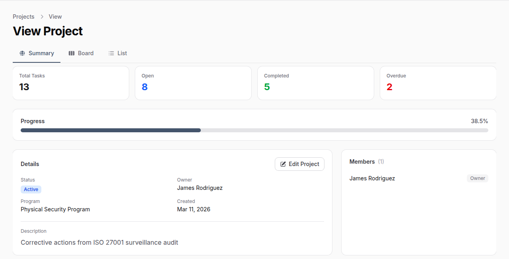
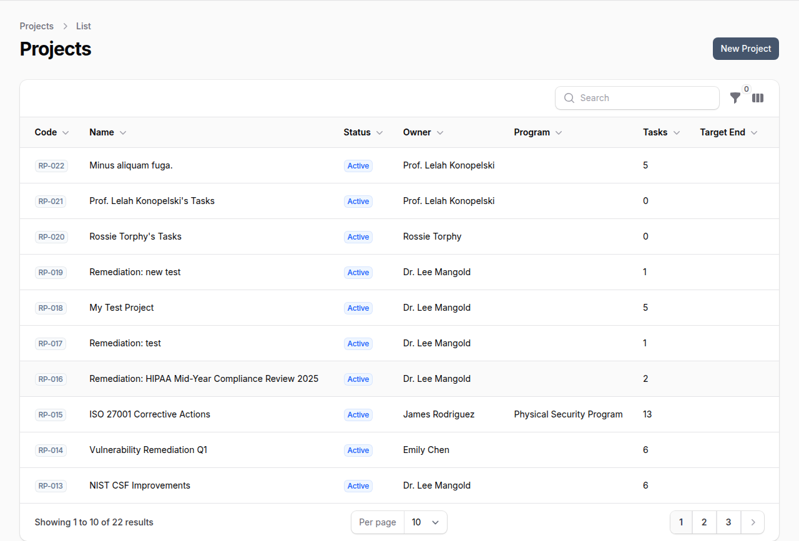
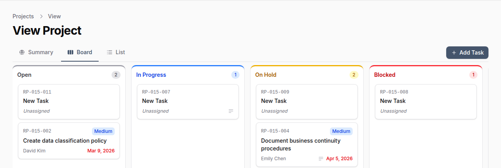
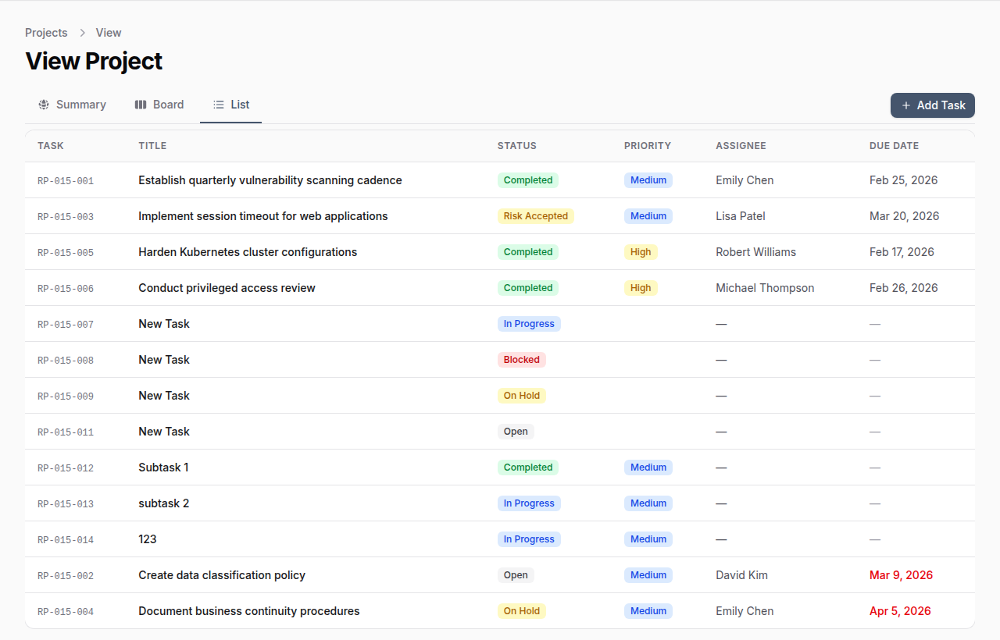

# Project Management (Remediation)

!!! enterprise "Enterprise Feature"
    Project Management is available exclusively in OpenGRC Enterprise. [Learn more about Enterprise](https://opengrc.com).

OpenGRC Project Management provides a structured way to track and remediate findings from audits, risk assessments, and compliance reviews. Create projects to organize corrective actions, assign tasks to team members, and monitor progress through Kanban boards or list views.

## Overview

Project Management helps organizations:

- Organize remediation efforts into trackable projects (POA&Ms)
- Create tasks directly from audit findings for full traceability
- Assign owners and due dates to ensure accountability
- Visualize work with Kanban boards or task lists
- Track progress with real-time statistics and completion percentages
- Manage team membership and roles per project

## Projects

### Project List

The project list shows all projects visible to you, including projects you own or are a member of.

### Project Attributes

| Field | Description |
|-------|-------------|
| **Code** | Auto-generated identifier (e.g., RP-015) |
| **Name** | Descriptive project name |
| **Description** | Details about the project scope and objectives |
| **Status** | Current project status |
| **Owner** | User responsible for the project |
| **Program** | Associated compliance program |
| **Start Date** | When work begins |
| **Target End Date** | Planned completion date |
| **Actual End Date** | When the project was actually completed |

### Project Statuses

| Status | Description |
|--------|-------------|
| **Planning** | Project is being scoped and planned |
| **Active** | Work is underway |
| **On Hold** | Project is temporarily paused |
| **Completed** | All tasks finished |
| **Archived** | Project retained for historical reference |

### Creating a Project

1. Navigate to **Project Management**
2. Click **New Project**
3. Fill in the project name, description, and assign an owner
4. Optionally link the project to a compliance program
5. Set target start and end dates

Projects can also be created automatically from audit findings, linking tasks directly to the audit items that generated them.

## Tasks

Tasks represent individual corrective actions or work items within a project. Each task tracks its status, priority, assignee, and due date.

### Task Attributes

| Field | Description |
|-------|-------------|
| **Task Number** | Auto-generated, scoped to the project (e.g., RP-015-001) |
| **Title** | Brief description of the task |
| **Description** | Detailed explanation of what needs to be done |
| **Status** | Current task status |
| **Priority** | Urgency level |
| **Type** | Category of work |
| **Owner** | User responsible for the task |
| **Assignee** | User assigned to complete the task |
| **Due Date** | Target completion date |
| **Weakness Description** | For findings -- describes the identified deficiency |

### Task Statuses

| Status | Description |
|--------|-------------|
| **Open** | Task created, not yet started |
| **In Progress** | Work is actively underway |
| **On Hold** | Task is temporarily paused |
| **Blocked** | Task cannot proceed due to a dependency or issue |
| **In Review** | Work is complete and awaiting review |
| **Completed** | Task is finished |
| **Cancelled** | Task was cancelled |
| **Risk Accepted** | Finding acknowledged but accepted without remediation |

### Task Priorities

| Priority | Description |
|----------|-------------|
| **Critical** | Requires immediate attention |
| **High** | Should be addressed soon |
| **Medium** | Standard priority |
| **Low** | Can be addressed when convenient |
| **Informational** | For tracking purposes only |

### Task Types

Tasks can be categorized as: **Remediation**, **Enhancement**, **Maintenance**, **Risk Acceptance**, **Investigation**, or **Documentation**.

## Views

### Summary View

The summary tab provides a high-level overview of the project, including:

- **Task statistics** -- Total, open, completed, and overdue task counts
- **Progress bar** -- Visual completion percentage
- **Project details** -- Status, owner, program, and dates
- **Team members** -- List of project members with their roles

### Kanban Board

The board tab displays tasks as cards organized by status columns. Drag and drop tasks between columns to update their status.

Each task card shows:

- Task number and title
- Priority level (color-coded)
- Assignee name
- Due date (highlighted in red if overdue)
- Subtask indicator

### Task List

The list tab shows all tasks in a table format with sortable columns for task number, title, status, priority, assignee, and due date.

## Creating Tasks from Audit Findings

One of the most powerful features of Project Management is the ability to create remediation tasks directly from audit findings. This maintains a traceable link between the original finding and the corrective action.

1. Navigate to an **Audit** and open an audit item
2. Click **Create Remediation Task**
3. Select the target project, set a priority, and assign the task
4. The task is created with the finding details pre-populated, including the weakness description from auditor notes

The source audit item remains linked to the task, providing full traceability from finding to remediation.

## Notifications

Team members are automatically notified when:

- They are assigned to a task
- A task they own changes status
- A project they are a member of has updates

## Permissions

Access to projects is scoped by membership. Users can only see projects they own or are members of. Administrators have visibility into all projects.
