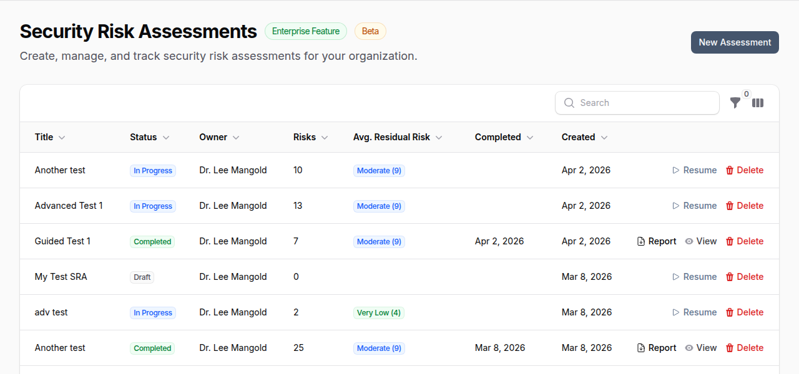
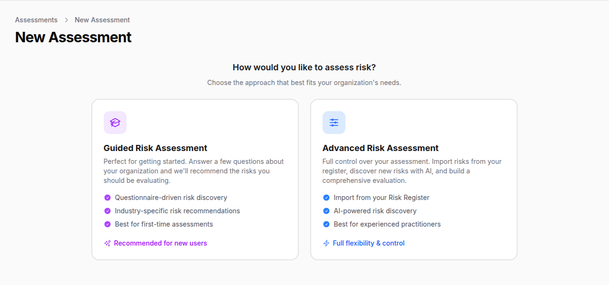
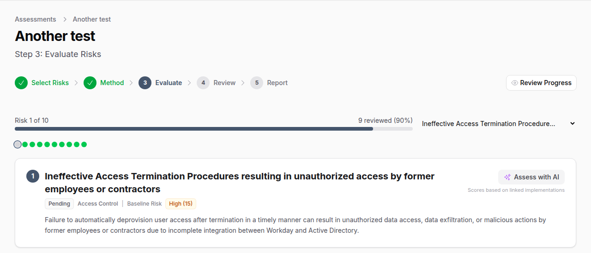
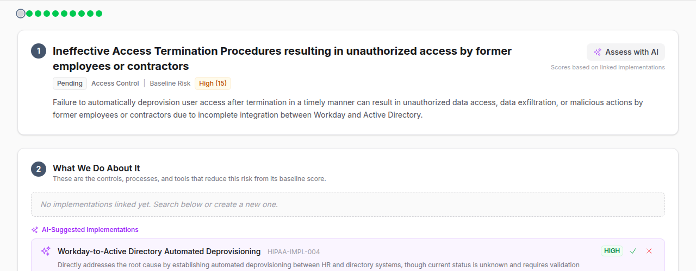
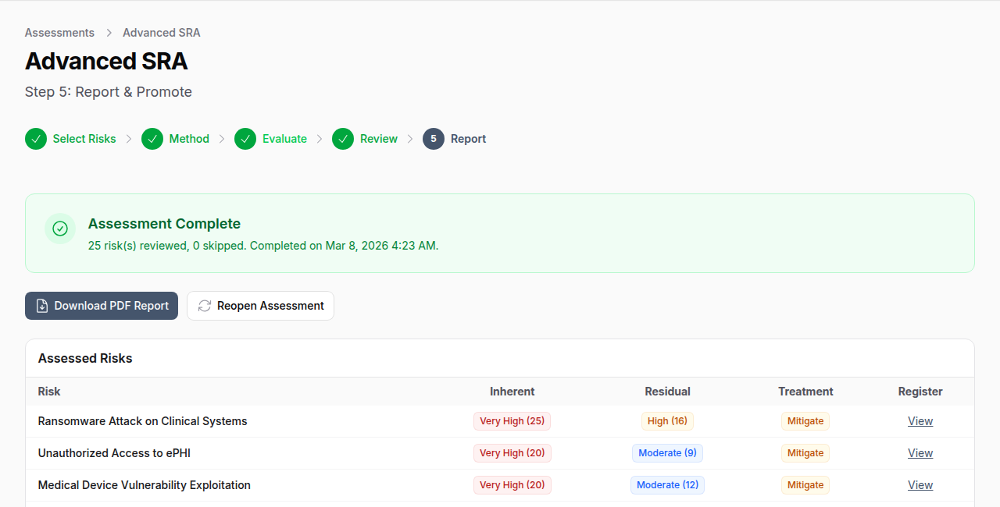

# Risk Assessor

!!! enterprise "Enterprise Feature"
    The Risk Assessor is available exclusively in OpenGRC Enterprise. [Learn more about Enterprise](https://opengrc.com).

OpenGRC Risk Assessor is an AI-powered security risk assessment platform. It guides organizations through a structured process to identify, evaluate, and treat risks -- with optional AI assistance at every step. Choose between a fully manual assessment or an AI-assisted guided mode that recommends risks based on your organization's profile.

## Overview

Risk Assessor helps organizations:

- Conduct structured security risk assessments with a step-by-step wizard
- Choose between **Manual** or **AI-Assisted** assessment modes
- Identify risks automatically by analyzing your existing controls and policies
- Score inherent and residual risk on a 5x5 likelihood-impact matrix
- Let AI evaluate residual risk based on your implemented controls
- Track risk treatment decisions with justification
- Promote assessed risks to the organizational Risk Register
- Generate PDF reports with risk heatmaps
- Schedule recurring assessments (monthly, quarterly, semi-annual, annual)

## Assessment Modes

### Guided Risk Assessment (AI-Assisted)

Best for organizations new to risk assessments or wanting comprehensive coverage.

1. Answer a questionnaire about your organization (industry, size, data types, regulations, controls)
2. AI recommends risks tailored to your profile
3. AI can discover additional risks by analyzing your implementations
4. Evaluate each risk with AI scoring assistance

### Advanced Risk Assessment (Manual)

Best for experienced practitioners who want full control.

1. Select risks from your existing Risk Register or create custom risks
2. AI can identify coverage gaps by analyzing your implementations
3. Evaluate each risk manually or with AI assistance

## The Assessment Wizard

Assessments follow a 5-step wizard workflow.

### Step 1: Select Risks

**Guided mode:** Answer questions about your organization across 10 sections -- industry, company size, business functions, operational models, data types handled, regulatory frameworks, security controls in place, governance programs, security testing programs, and desired detail level. AI then recommends risks matched to your profile.

You can also run **AI Risk Discovery** which analyzes your implementations to find coverage gaps and additional risks specific to your environment.

**Manual mode:** Search and add risks from the Risk Register, add all active risks at once, or create custom risks with title, description, and inherent likelihood/impact scores.

### Step 2: Assessment Method

Configure assessment-wide settings before evaluation begins.

### Step 3: Evaluate Risks

The core of the assessment. Each risk is presented individually with a progress indicator showing your position (e.g., "Risk 1 of 25").

Each risk evaluation includes four sections:

**The Risk** -- Title, description, category, inherent risk score (likelihood x impact), and status. Click **Assess with AI** to have the AI score the risk automatically based on your controls.

**What We Do About It (Implementations)** -- Shows controls linked to this risk. Accepted implementations appear in green. AI-suggested implementations appear in purple with accept/reject buttons. You can search for and link additional implementations or create new ones inline.

**Risk Scoring** -- Set residual likelihood (1-5) and residual impact (1-5) using color-coded buttons. The residual risk score updates in real-time. When AI scores a risk, these values are pre-filled with the AI's recommendation.

**Treatment & Justification** -- Select a treatment strategy and provide justification for your decision.

### Step 4: Review & Finalize

Review all evaluated risks in a summary table showing inherent scores, residual scores, and treatment decisions. **Promote** individual risks to your organizational Risk Register. Click **Finalize** to mark the assessment as complete.

### Step 5: Report & Promote

Download the PDF report, promote remaining risks to the register, or reopen the assessment for further changes.

## AI-Powered Features

### AI Risk Identification

AI analyzes your organization's implementations and controls to identify:

- **Coverage risks** -- Risks your controls are designed to mitigate (validates coverage)
- **Gap risks** -- Risks not adequately addressed by existing controls (blind spots)

The AI avoids duplicating risks already in your Risk Register using word-overlap matching.

### AI Residual Scoring

When you click **Assess with AI** on a risk, the AI:

1. Reviews all implementations linked to the risk
2. Weights each by implementation status (Implemented = full credit, Partially = 50%, Not = none) and effectiveness
3. Considers relevant organizational policies (max 1-point reduction from policies alone)
4. Suggests residual likelihood and impact scores with justification
5. Recommends a treatment strategy
6. Suggests additional implementations that could further reduce the risk
7. Returns a confidence score (0.0-1.0)

### AI Implementation Matching

For each risk, AI identifies which of your existing implementations are relevant as mitigating controls. Matches include confidence scores and reasoning. You accept or reject each suggestion.

### Batch AI Assessment

For large assessments, run AI scoring on all pending risks at once. The job processes risks in the background and notifies you when complete.

## Risk Scoring

### Scale

| Score | Likelihood | Impact |
|-------|-----------|--------|
| **1** | Rare | Negligible |
| **2** | Unlikely | Minor |
| **3** | Possible | Moderate |
| **4** | Likely | Major |
| **5** | Almost Certain | Severe |

### Risk Score Calculation

Risk Score = Likelihood x Impact (range: 1-25)

| Score Range | Level | Color |
|-------------|-------|-------|
| 1-4 | Very Low | Green |
| 5-8 | Low | Blue |
| 9-12 | Moderate | Yellow |
| 13-16 | High | Orange |
| 17-25 | Very High | Red |

### Treatment Options

| Treatment | Description |
|-----------|-------------|
| **Avoid** | Stop the activity creating the risk |
| **Mitigate** | Implement controls to reduce likelihood or impact |
| **Transfer** | Shift risk via insurance, outsourcing, or contracts |
| **Accept** | Acknowledge and monitor the residual risk |

## Recurring Assessments

Schedule assessments to repeat automatically:

| Frequency | Use Case |
|-----------|----------|
| **Monthly** | High-risk environments requiring frequent review |
| **Quarterly** | Standard compliance cadence (SOC 2, PCI) |
| **Semi-Annual** | Moderate risk environments |
| **Annual** | Regulatory requirements (HIPAA, ISO 27001) |

When a recurring assessment's scheduled date arrives, a new assessment is created from the completed one, allowing you to track risk trends over time.

## PDF Reports

Generated reports include:

- Assessment metadata (title, owner, mode, dates)
- Risk summary statistics (total, reviewed, skipped)
- **Inherent risk heatmap** -- 5x5 grid showing risk distribution before controls
- **Residual risk heatmap** -- 5x5 grid showing risk distribution after controls
- Detailed risk table with inherent/residual scores, treatment, justification, and linked implementations

## Collaboration

Assessments support multiple users with role-based access:

| Role | Capabilities |
|------|-------------|
| **Owner** | Full control over the assessment |
| **Contributor** | Add and evaluate risks |
| **Reviewer** | Review and approve risk evaluations |

## Best Practices

- **Start with Guided mode** if this is your first risk assessment -- the questionnaire ensures comprehensive coverage
- **Use AI scoring as a starting point** -- review and adjust AI recommendations rather than accepting blindly
- **Accept or reject AI implementation matches** -- this improves the accuracy of residual scoring
- **Document justifications** -- treatment justifications are critical for auditors and compliance evidence
- **Promote high-priority risks** -- move assessed risks to the Risk Register for ongoing tracking
- **Schedule recurring assessments** -- risk is dynamic; regular reassessment catches changes
- **Download the PDF report** -- share with stakeholders and retain for compliance records

!!! warning "AI Usage Quota"
    AI risk identification and scoring consume AI tokens. Both individual and batch assessments count against your organization's AI usage quota. Monitor usage in **Settings > AI**.
