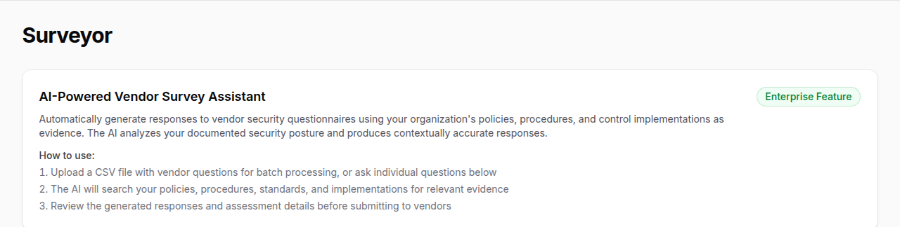
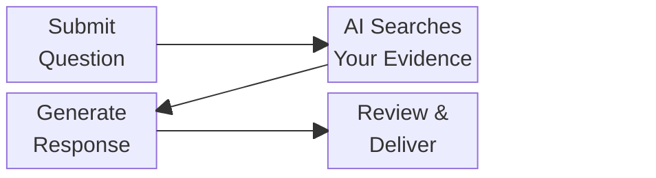
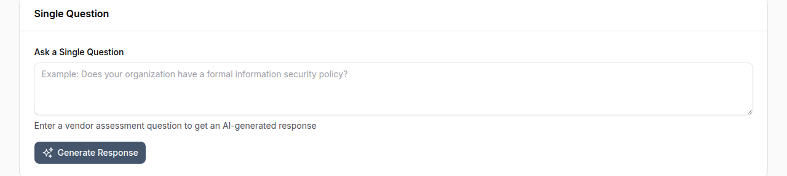
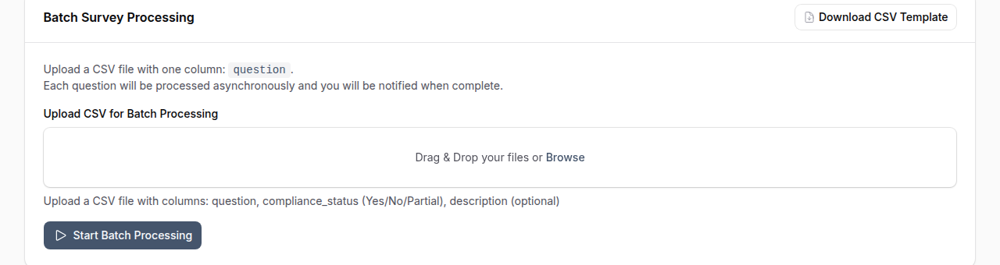
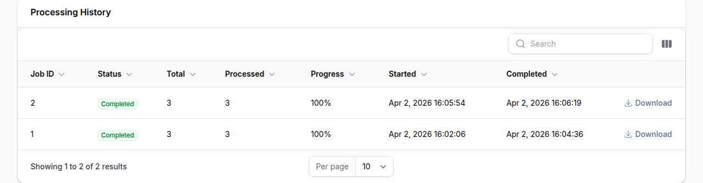

# Surveyor (Survey Responder)

!!! enterprise "Enterprise Feature"
    The Surveyor module is available exclusively in OpenGRC Enterprise. [Learn more about Enterprise](https://opengrc.com).

OpenGRC Surveyor automates the process of responding to vendor security questionnaires, RFPs, and compliance assessments. Using AI, Surveyor searches your organization's documented policies, procedures, standards, and control implementations to generate evidence-based responses.

## Overview

Surveyor helps organizations:

- Respond to vendor security questionnaires in minutes instead of hours
- Generate evidence-based answers grounded in your documented security posture
- Process individual questions or batch-upload entire questionnaires via CSV
- Receive structured assessments with verdict, confidence, and coverage ratings
- Track batch processing jobs with real-time progress updates

## How It Works

1. **Submit a question** -- Enter a single question or upload a CSV file with multiple questions
2. **Evidence gathering** -- Surveyor searches your policies, procedures, standards, and implementations for relevant evidence
3. **AI response generation** -- An AI agent crafts a professional response with supporting assessment details
4. **Review and deliver** -- Review the response, adjust if needed, and deliver to the requesting party

## Single Question Mode

Use single question mode for quick, one-off responses during calls or meetings.

1. Navigate to **Apps > Survey Responder**
2. Enter the vendor's question in the text area
3. Click **Generate Response**
4. Review the generated answer and assessment details

### Assessment Details

Each response includes a structured assessment:

| Field | Description |
|-------|-------------|
| **Verdict** | Whether the organization meets, partially meets, or does not meet the requirement |
| **Confidence** | How confident the AI is in the response (High, Medium, Low) |
| **Coverage** | How well existing documentation covers the question (Full, Partial, None) |
| **Rationale** | Explanation of the assessment reasoning |
| **Evidence Used** | List of specific policies, controls, or implementations referenced |
| **Needs Human Review** | Flag indicating if the response should be manually verified |

### Verdict Definitions

| Verdict | Meaning |
|---------|---------|
| **Meets Requirements** | Full compliance evidence found across multiple sources |
| **Partially Meets Requirements** | Some evidence exists but gaps or incomplete controls were identified |
| **Does Not Meet Requirements** | No supporting evidence found or non-compliance detected |

## Batch Processing Mode

Use batch processing for full vendor questionnaires with many questions.

### Uploading a Questionnaire

1. Navigate to **Apps > Survey Responder**
2. Download the **CSV Template** to see the expected format
3. Prepare your CSV file with a `question` column containing each question
4. Upload the CSV file (max 10 MB, up to 100 questions per batch)
5. Click **Start Batch Processing**

The job is queued for background processing. You can navigate away -- you will be notified when processing is complete.

### CSV Format

The CSV file must include a `question` column header. Additional columns are preserved in the output.

**Input example:**

| question |
|----------|
| Does your organization have a formal information security policy? |
| How do you handle access control for sensitive systems? |
| What encryption standards do you use for data at rest? |

**Output:** The original CSV with additional columns for the AI-generated answer and all assessment fields.

### Monitoring Progress

The **Processing History** table at the bottom of the page shows all your batch jobs:

| Column | Description |
|--------|-------------|
| **Job ID** | Unique identifier |
| **Status** | Pending, Processing, Completed, Failed, or Cancelled |
| **Total Questions** | Number of questions in the batch |
| **Processed** | Number of questions completed so far |
| **Progress** | Percentage complete |
| **Created** | When the job was submitted |
| **Completed** | When processing finished |

You can **cancel** a pending or in-progress job, or **download** the results CSV once complete.

## Configuration

Surveyor settings can be configured via environment variables:

| Setting | Default | Description |
|---------|---------|-------------|
| `MODULE_SURVEYOR_ENABLED` | `true` | Enable or disable the Surveyor module |
| `SURVEYOR_MAX_FILE_SIZE` | `10` | Maximum CSV upload size in MB |
| `SURVEYOR_MAX_BATCH_QUESTIONS` | `100` | Maximum questions per batch job |
| `SURVEYOR_TIMEOUT_PER_QUESTION` | `120` | Processing timeout per question in seconds |

## Best Practices

- **Keep your policies and procedures up to date** -- Surveyor's response quality directly depends on the documentation in your OpenGRC instance
- **Review AI-generated responses before sending** -- Always verify responses flagged with "Needs Human Review"
- **Use batch mode for full questionnaires** -- It is more efficient and provides a downloadable CSV for easy delivery
- **Add implementations to your controls** -- The more detailed your control implementations, the better the evidence Surveyor can cite
- **Upload supporting documents** -- Surveyor searches document chunks for additional context beyond structured data

## Permissions

Access to the Surveyor module requires the appropriate user permissions. Contact your OpenGRC administrator if you cannot see the Survey Responder page.

!!! warning "AI Usage Quota"
    Surveyor consumes AI tokens for each question processed. Both single questions and batch processing count against your organization's AI usage quota. Monitor your quota usage in **Settings > AI**.
