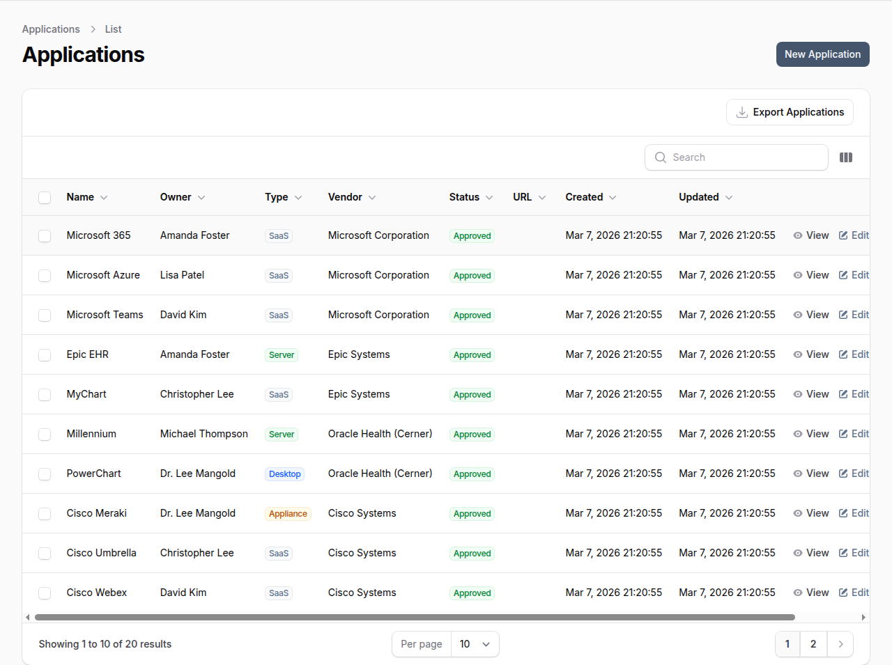
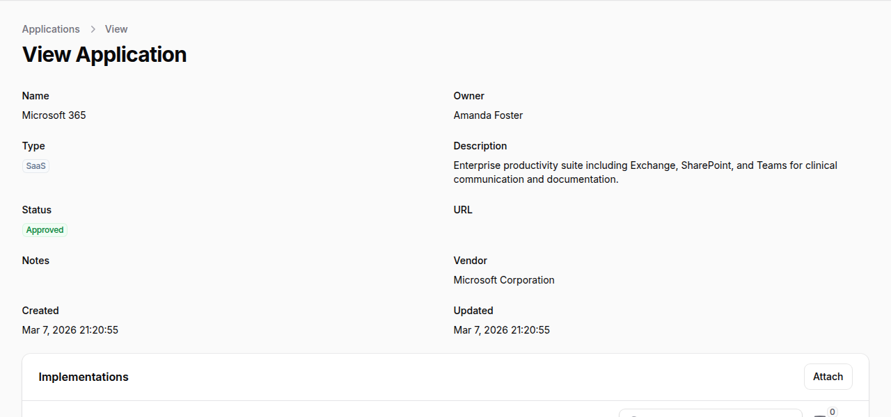

# Applications

OpenGRC provides application inventory management to track software applications used across the organization. Each application is linked to a vendor, enabling integrated third-party risk management.

## Overview

Application management in OpenGRC enables organizations to:

- Maintain a software application inventory
- Track application ownership and accountability
- Categorize applications by type and deployment model
- Manage application approval status
- Link applications to vendors for risk assessment
- Control shadow IT through approval workflows

## Application Attributes

Each application record includes:

| Field | Description |
|-------|-------------|
| **Name** | Application name |
| **Owner** | User responsible for the application |
| **Type** | Application type (SaaS, Desktop, Server, etc.) |
| **Status** | Approval status |
| **Vendor** | Vendor providing the application (required) |
| **URL** | Application URL or access point |
| **Description** | Detailed description of the application |
| **Notes** | Internal notes |
| **Logo** | Application logo image |

## Application Types

Applications are classified by deployment type:

| Type | Description |
|------|-------------|
| **SaaS** | Cloud-based software as a service |
| **Desktop** | Locally installed desktop application |
| **Server** | Server-based application |
| **Appliance** | Hardware/software appliance |
| **Other** | Other application types |

## Application Statuses

| Status | Description |
|--------|-------------|
| **Approved** | Application is approved for use |
| **Rejected** | Application is not approved for use |
| **Limited** | Application approved with restrictions |
| **Expired** | Application approval has expired |

## Vendor Requirement

Every application in OpenGRC **must be linked to a vendor**. This requirement ensures:

- All third-party software is tracked with its provider
- Vendor risk assessments cover associated applications
- Changes to vendor status affect related applications
- Complete visibility into vendor-application relationships

If an application's vendor is not yet in the system, add the vendor first before creating the application.

## Creating an Application

1. Ensure the vendor exists in **Vendor Management** (create it first if needed)
2. Navigate to **Applications** in the main navigation
3. Click **New Application**
4. Enter the application **Name**
5. Select the **Owner**, **Type**, **Status**, and **Vendor**
6. Optionally add a **URL**, **Description**, **Notes**, and **Logo**
7. Click **Create** to save

## Viewing an Application

The application detail view shows all attributes and linked entities.

The detail view includes:

- **Name** and **Owner** at the top
- **Type** and **Status** badges
- **Description** and **URL**
- **Vendor** link to the associated vendor record
- **Implementations** tab to link related control implementations

## Application-Vendor Relationship

### Viewing Vendor's Applications
From a vendor detail page, go to the **Applications** tab to see all applications from that vendor.

### Vendor Status Impact
When a vendor's status changes, review associated applications:

- If vendor is **Rejected** -- Consider rejecting related applications
- If vendor is **Terminated** -- Plan application migration or replacement
- If vendor is **Expired** -- Review and renew or replace applications

## Filtering and Searching

**Search** applications by name, owner, or vendor name.

**Filter** applications by:

- **Type** -- SaaS, Desktop, Server, etc.
- **Status** -- Approved, Rejected, Limited, Expired
- **Vendor**
- **Owner**

## Shadow IT Control

Use application management to control shadow IT:

1. **Document all applications** -- Create records for all known applications
2. **Assign owners** -- Ensure every application has an accountable owner
3. **Require approval** -- Use status to track approval state
4. **Link to vendors** -- Connect applications to vendor risk assessments
5. **Regular review** -- Periodically audit the application inventory

## Best Practices

- **Link all applications to vendors** -- Ensure complete vendor visibility
- **Assign clear ownership** -- Every application needs an accountable owner
- **Use appropriate types** -- Categorize applications accurately for reporting
- **Review status regularly** -- Keep approval status current
- **Document decisions** -- Use notes to record approval reasoning
- **Connect to vendor assessments** -- Consider vendor risk when approving applications
- **Track URLs** -- Maintain accurate access URLs for reference
- **Audit periodically** -- Regularly review the application inventory for accuracy
