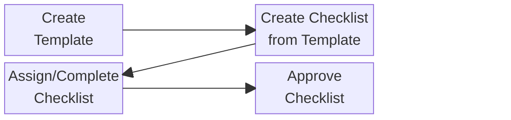

# Checklists

OpenGRC provides a comprehensive checklist system for tracking recurring tasks, compliance activities, and operational procedures. Checklists are created from reusable templates and support assignment, completion tracking, and approval workflows.

## Overview

The checklist feature supports:

- Reusable templates with customizable items
- Multiple item types (checkbox, text, file upload, etc.)
- User assignment and due dates
- Progress tracking and completion status
- Approval workflow with digital signatures
- Recurring schedules for automated checklist generation

### Process Overview
1. Create a new Template
2. Create a new Checklist based on that template
3. Assign / Complete the Checklist
4. Approve

**Example:** A "Monthly Security Review" template can generate a new checklist each month for your team to complete.

## Creating a Template

### Step 1: Navigate to Templates
1. Go to **Checklists** in the main navigation
2. Click **Templates** dropdown
3. Click **Create Template**

### Step 2: Enter Template Details
1. **Title** - Enter a descriptive template name
2. **Description** - Optionally describe the template's purpose
3. **Status** - Select Draft while building, change to Active when ready

### Step 3: Configure Assignment (Optional)
1. **Default Assignee** - Select a user to automatically assign checklists
2. This can be overridden when creating individual checklists

### Step 4: Configure Recurrence (Optional)
Set up automatic checklist generation:

1. **Frequency** - Daily, Weekly, Monthly, Quarterly, or Yearly
2. **Interval** - How often (e.g., every 2 weeks)
3. **Day of Week** - For weekly recurrence
4. **Day of Month** - For monthly recurrence

### Step 5: Add Checklist Items
For each item:

1. Click **Add Item**
2. **Item Text** - Enter the question or task description
3. **Item Type** - Select the response type
4. **Required** - Toggle whether the item must be completed
5. **Allow Comments** - Toggle to allow additional notes
6. **Help Text** - Optional guidance for the assignee
7. For choice items, add the available options

### Step 6: Save
Click **Create** to save the template.

!!! warning "Template Locking"
    Once a checklist has been created from a template, the template items become locked and cannot be modified. This ensures consistency across all checklists created from the same template.

## Creating a Checklist

### Step 1: Navigate to Checklists
1. Go to **Checklists** in the main navigation
2. Click **New Checklist**

### Step 2: Select Template
1. Choose an **Active** template from the dropdown
2. Only active templates are available for selection

### Step 3: Configure Assignment
1. **Assigned To** - Select the user responsible for completion
2. **Due Date** - Set when the checklist should be completed

### Step 4: Save
Click **Create** to create the checklist.

## Completing a Checklist

### Step 1: Open the Checklist
1. Navigate to your assigned checklists
2. Click on a checklist to view it

### Step 2: Fill Out Items
1. Click **Fill Out** to enter response mode
2. Complete each item according to its type:
    - **Checkbox** - Check Yes or No
    - **Text** - Enter your response
    - **Choice** - Select from available options
    - **File** - Upload required documents
3. Add comments where allowed and helpful

### Step 3: Save Progress
- Click **Save Progress** to save and continue later
- Your responses are preserved between sessions

### Step 4: Submit
- Click **Submit Checklist** when all required items are complete
- The checklist status changes to Completed

## Checklist Statuses

| Status | Description |
|--------|-------------|
| **Not Started** | Checklist created but no items completed |
| **In Progress** | Some items have been answered |
| **Completed** | All required items submitted |

## Approving a Checklist

For checklists requiring approval:

### Step 1: Open Completed Checklist
1. Navigate to completed checklists awaiting approval
2. Click on the checklist to review

### Step 2: Review Responses
1. Examine all responses for completeness and accuracy
2. Review any uploaded files or attachments

### Step 3: Approve
1. Click **Approve**
2. Enter your digital signature
3. Optionally add approval notes
4. Confirm the approval

The checklist now shows as approved with the approver's signature and timestamp.

## Recurring Checklists

Templates can automatically generate checklists on a schedule:

| Frequency | Description |
|-----------|-------------|
| **Daily** | Every day or every X days |
| **Weekly** | On a specific day of the week |
| **Monthly** | On a specific day of the month |
| **Quarterly** | Every 3 months |
| **Yearly** | Once per year |

### How It Works

1. Configure recurrence settings on the template
2. Set the template status to **Active**
3. The system automatically creates new checklists based on the schedule
4. New checklists are assigned to the template's default assignee
5. Due dates are calculated based on the recurrence pattern

## Filtering and Searching

### Search
Search checklists by:

- Title
- Template name
- Assignee name

### Filters
Filter the checklist list by:

- **Status** - Not Started, In Progress, Completed
- **Template** - Filter by source template
- **Assigned To** - Filter by assignee
- **Due Date** - Filter by due date range
- **Approval Status** - Pending, Approved

## Best Practices

- **Start with Draft** - Build templates in Draft status, switch to Active when ready
- **Use clear item text** - Write items as clear questions or tasks
- **Add help text** - Provide guidance for complex items
- **Set appropriate types** - Choose item types that match the expected response
- **Plan recurrence carefully** - Consider workload when setting up recurring checklists
- **Review before approval** - Thoroughly review completed checklists before approving
- **Clone templates** - Use the duplicate feature to create variations of existing templates

---

## Permissions

| Permission | Capabilities |
|------------|--------------|
| **List Checklists** | View the checklist list |
| **Create Checklists** | Create new checklists |
| **Read Checklists** | View checklist details |
| **Update Checklists** | Edit and complete checklists |
| **Delete Checklists** | Remove checklists |
| **List ChecklistTemplates** | View the template list |
| **Create ChecklistTemplates** | Create new templates |
| **Read ChecklistTemplates** | View template details |
| **Update ChecklistTemplates** | Edit templates |
| **Delete ChecklistTemplates** | Remove templates |

Default role assignments:

- **Super Admin** - All permissions
- **Security Admin** - List, Create, Read, Update (no Delete)
- **Regular User** - List, Read only

## Template Attributes

Each template includes the following information:

| Field | Description |
|-------|-------------|
| **Title** | Template name |
| **Description** | Optional description of the template's purpose |
| **Status** | Draft, Active, or Archived |
| **Default Assignee** | User automatically assigned when creating checklists |
| **Recurrence** | Schedule for automatic checklist generation |
| **Items** | The checklist items to be completed |

## Template Statuses

| Status | Description |
|--------|-------------|
| **Draft** | Template is being developed, cannot create checklists |
| **Active** | Template is ready for use, can create checklists |
| **Archived** | Template is retired, cannot create new checklists |

## Checklist Item Types

Templates support multiple item types to capture different kinds of responses:

| Type | Description | Use Case |
|------|-------------|----------|
| **Yes/No Checkbox** | Simple boolean confirmation | "Has the backup been verified?" |
| **Short Text** | Brief text response (single line) | "Enter the ticket number" |
| **Long Text** | Detailed text response (multi-line) | "Describe any issues encountered" |
| **Single Choice** | Select one option from a list | "Select the severity level" |
| **Multiple Choice** | Select multiple options from a list | "Select all applicable categories" |
| **File Upload** | Attach documents or evidence | "Upload the scan report" |

