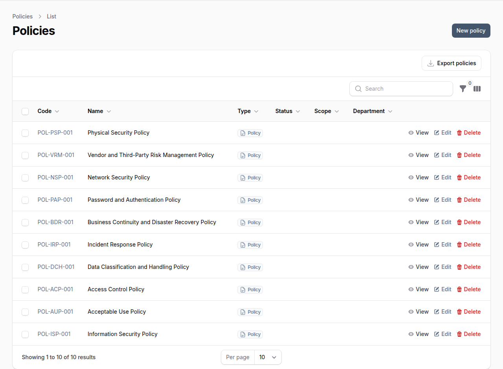
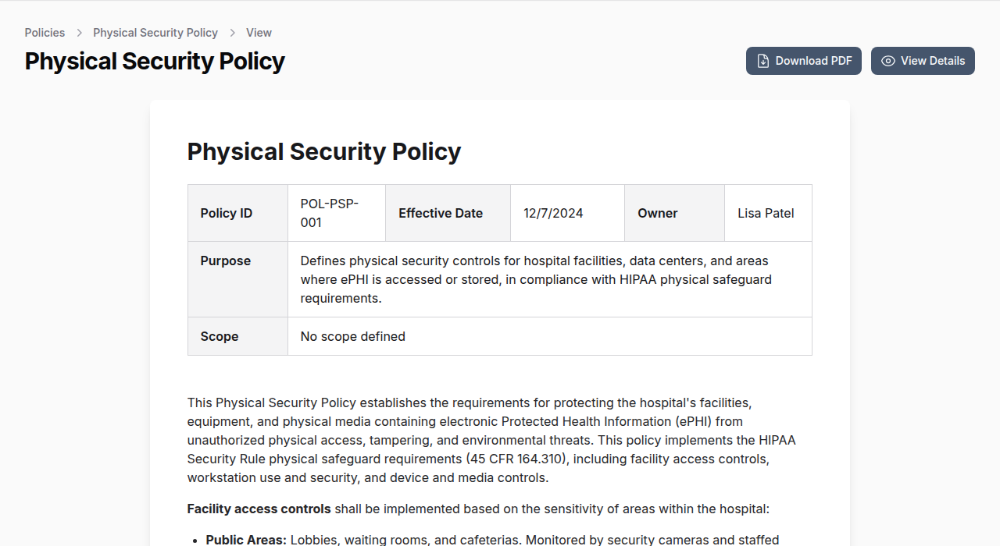

# Policies

OpenGRC provides comprehensive policy management capabilities to create, maintain, and track organizational security and compliance policies. Policies can be linked to controls, implementations, and risks for complete traceability.

## Overview

Policies in OpenGRC are organizational documents that define rules, guidelines, and standards for security and compliance. The policy management feature supports:

- Full policy lifecycle management (draft to retirement)
- Version control with revision history
- Document attachments (PDF, Word, DOCX)
- Linking to controls, implementations, and risks
- Department and scope classification
- Owner assignment and accountability

## Policy Attributes

Each policy includes the following information:

| Field | Description |
|-------|-------------|
| **Code** | Unique identifier (e.g., POL-001) |
| **Name** | Policy title |
| **Status** | Current lifecycle status |
| **Type** | Document type (Policy, Procedure, Standard) |
| **Department** | Responsible department |
| **Scope** | Applicability scope |
| **Owner** | Policy owner (user) |
| **Effective Date** | When the policy takes effect |
| **Retired Date** | When the policy was retired (if applicable) |
| **Policy Scope** | Rich text describing what the policy covers |
| **Purpose** | Rich text describing why the policy exists |
| **Body** | Full policy content (rich text) |
| **Document** | Attached policy document file |
| **Revision History** | Version tracking with dates and changes |

## Policy Statuses

Policies progress through the following statuses:

| Status | Description |
|--------|-------------|
| **Draft** | Initial draft, not yet reviewed |
| **In Review** | Under review by stakeholders |
| **Awaiting Feedback** | Waiting for stakeholder input |
| **Pending Approval** | Awaiting formal approval |
| **Approved** | Officially approved and active |
| **Archived** | No longer active but retained for reference |
| **Superseded** | Replaced by a newer policy version |
| **Retired** | Permanently retired from use |

## Policy Scope Levels

Policies can be scoped to different organizational levels:

- **Organization-wide** -- Applies to the entire organization
- **Department-specific** -- Applies to a specific department
- **Project-specific** -- Applies to a specific project
- **Regional** -- Applies to a specific region
- **Global** -- Applies globally across all entities

## Creating a Policy

1. Navigate to **Policies** in the main navigation
2. Click **New Policy**
3. Enter a unique **Code** or use the auto-generated format
4. Enter a descriptive **Name**
5. Select the **Status** (typically Draft)
6. Select the **Department** and **Scope**
7. Assign a policy **Owner**
8. Set the **Effective Date**
9. Add policy content in **Policy Scope**, **Purpose**, and **Body** fields
10. Optionally attach a document (PDF, DOC, DOCX -- max 10MB)
11. Click **Create** to save

## Viewing a Policy

The policy detail view shows the full policy content with metadata in a clean, readable format.

The detail view includes:

- **Header** with policy code, effective date, owner, and status
- **Purpose** section explaining why the policy exists
- **Scope** section defining applicability
- **Body** with full policy content rendered as rich text
- **Attached document** available for download
- **Revision history** table tracking all versions

## Linking Policies

### Controls
Associate policies with security controls:

1. Open the policy detail view
2. Go to the **Controls** tab
3. Click **Attach** to add controls
4. Search and select relevant controls

### Implementations
Associate policies with implementations:

1. Open the policy detail view
2. Go to the **Implementations** tab
3. Click **Attach** to add implementations

### Risks
Associate policies with risks they address:

1. Open the policy detail view
2. Go to the **Risks** tab
3. Click **Attach** to add risks

## Version Control

### Adding Revisions
When updating a policy:

1. Open the policy for editing
2. Scroll to **Revision History**
3. Click **Add Revision**
4. Fill in version number, date, author, and changes description
5. Save the policy

### Viewing Revision History
The revision history displays all versions chronologically, showing version number, revision date, author, and summary of changes.

## Filtering and Searching

**Search** policies by code, name, scope content, or purpose content.

**Filter** the policy list by:

- **Status** -- Draft, Approved, Archived, etc.
- **Scope** -- Organization-wide, Department-specific, etc.
- **Department** -- Responsible department
- **Has Document** -- Whether a document is attached

## Permissions

| Permission | Capabilities |
|------------|--------------|
| **List Policies** | View the policy list |
| **Create Policies** | Create new policies |
| **Read Policies** | View policy details |
| **Update Policies** | Edit existing policies |
| **Delete Policies** | Remove policies |

## Best Practices

- **Use consistent naming** -- Establish a naming convention for policy codes and titles
- **Set review schedules** -- Plan regular policy reviews (annually recommended)
- **Track all changes** -- Add revision history entries for every significant update
- **Link to controls** -- Connect policies to the controls they support for traceability
- **Assign clear ownership** -- Every policy should have an accountable owner
- **Archive don't delete** -- Use Archive or Retired status instead of deleting policies
- **Keep documents current** -- Update attached documents when policies change
