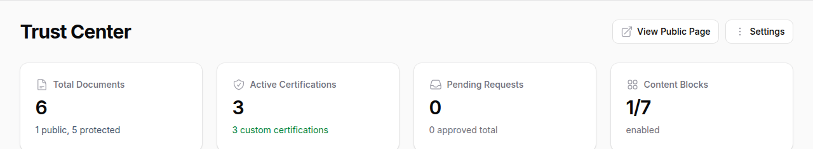
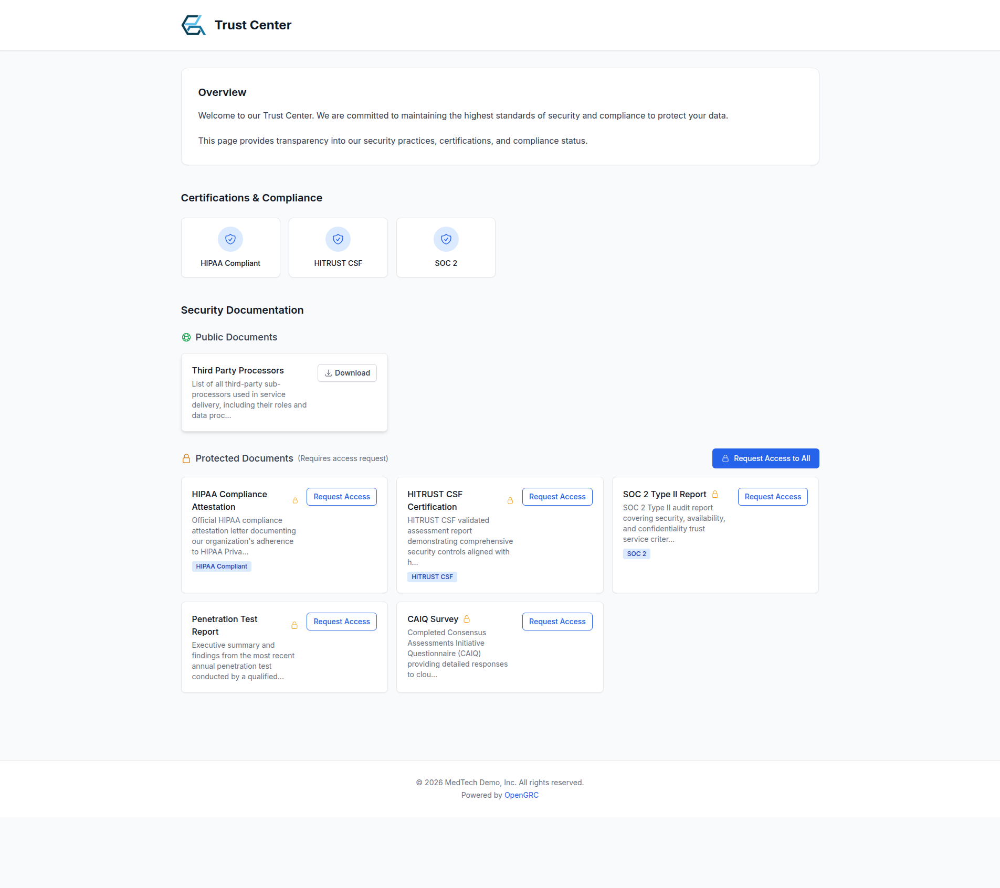
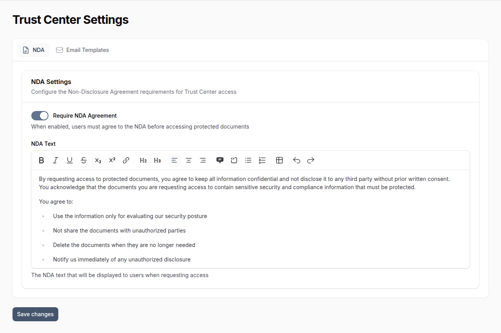
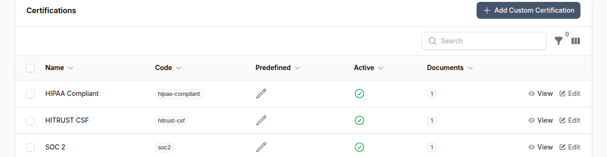
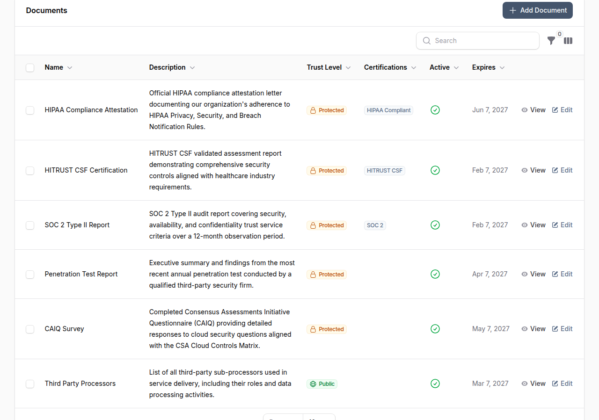
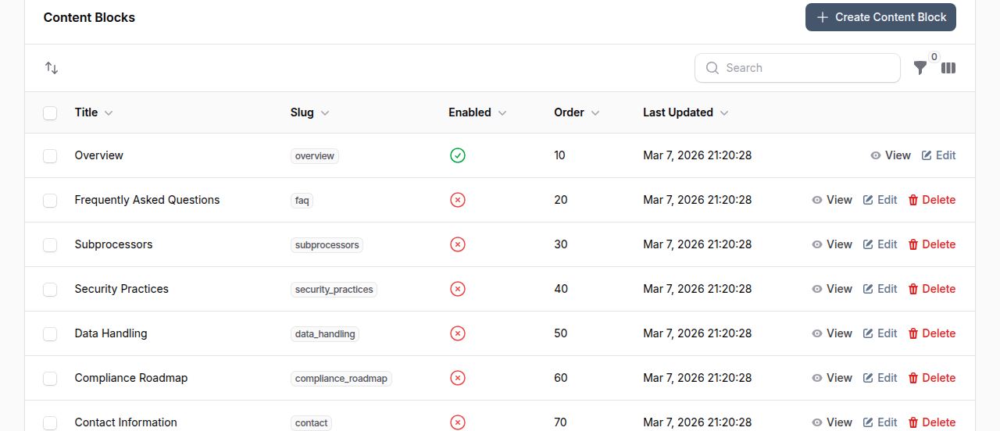
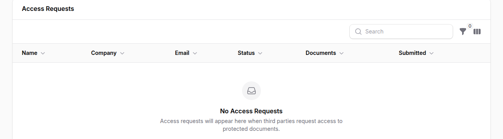
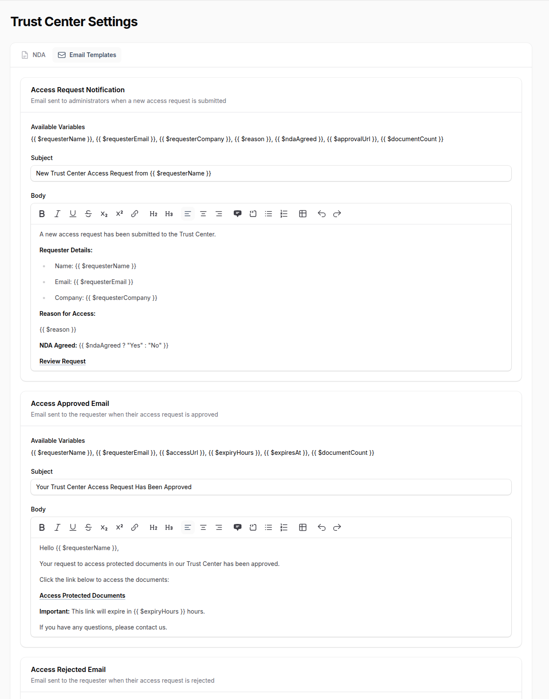

# Trust Center

The Trust Center is a public-facing document sharing portal that allows organizations to securely share compliance, security, and certification documents with external stakeholders. It provides controlled access with approval workflows, document classification, and expiration management.

## Overview

The Trust Center enables third parties (customers, auditors, partners) to access sensitive security and compliance documents through a request-approval workflow while maintaining full control and audit trails.



**Key Capabilities:**

- Public and protected document hosting
- Access request approval workflow
- NDA agreement enforcement
- Magic link access with expiration
- Customizable branding and content
- Email notifications for requests and approvals
- Document organization by certification

## Public Trust Center

Your public Trust Center is accessible at:

```
https://your-domain.com/trust/
```

Share this URL with customers, auditors, and partners who need access to your security documentation.



The public page displays:

- **Content blocks** -- Custom sections like overview, FAQ, and security practices
- **Certifications** -- Badges for your compliance frameworks (SOC 2, ISO 27001, HIPAA, etc.)
- **Public documents** -- Downloadable without authentication
- **Protected documents** -- Require an access request and approval

## Document Types

### Public Documents
Documents marked as **Public** are available to anyone who visits your Trust Center without authentication or approval. Use this for documents you want broadly accessible.

### Protected Documents
Documents marked as **Protected** require an access request and approval before viewing. When a visitor requests access:

1. They provide their name, email, company, and reason for access
2. They agree to your NDA (if enabled)
3. An administrator reviews and approves or rejects the request
4. Approved requests receive a magic link via email

## Setting Up Your Trust Center

### Step 1: Configure Basic Settings

1. Navigate to **Trust Center** in the main navigation
2. Click **Settings** in the header
3. Configure your company name and branding

### Step 2: Configure NDA Settings

1. In Trust Center Settings, go to the **NDA** tab
2. Toggle NDA requirement on or off
3. Customize the NDA text using the rich text editor
4. Save your changes



### Step 3: Add Certifications

Certifications help organize your documents by compliance framework or standard.

1. From Trust Center Manager, go to the **Certifications** tab
2. Click **Add Custom Certification**
3. Add certifications like SOC 2, ISO 27001, HIPAA, etc.
4. Each certification can have multiple documents associated with it



### Step 4: Upload Documents

1. From Trust Center Manager, go to the **Documents** tab
2. Click **Add Document** to add a new document
3. Fill in the document details



#### Document Fields

| Field | Description |
|-------|-------------|
| **Name** | Document title |
| **Description** | Brief description of what the document contains |
| **Trust Level** | PUBLIC or PROTECTED |
| **Requires NDA** | Whether requesters must agree to NDA |
| **Certifications** | Which certifications this document relates to |
| **File** | Upload the document (PDF, Word, Excel, or images, max 20MB) |
| **Valid From/Until** | Optional validity period |
| **Active** | Toggle to show/hide without deleting |
| **Sort Order** | Control display ordering |

### Step 5: Customize Content Blocks

Add custom content sections to your public Trust Center page:

1. Go to the **Content Blocks** tab
2. Click **Create Content Block**
3. Add a title, content, and optional icon
4. Enable/disable and reorder as needed



## Managing Access Requests

### Reviewing Requests

When someone requests access to protected documents:

1. You receive an email notification and in-app notification
2. Navigate to **Trust Center** > **Access Requests** tab
3. Review the request details



Request details include:

| Field | Description |
|-------|-------------|
| **Name** | Requester's full name |
| **Company** | Requester's organization |
| **Email** | Requester's email address |
| **Status** | Pending, Approved, or Rejected |
| **Documents** | Number of documents requested |
| **Submitted** | When the request was made |

### Approving Requests

1. Click the **Approve** action on a pending request
2. Optionally add notes for internal reference
3. The system generates a magic link and sends an approval email
4. The requester can access documents for the configured duration (default: 24 hours)

### Rejecting Requests

1. Click the **Reject** action on a pending request
2. Provide a reason (sent to the requester via email)
3. The requester receives a rejection notification

## Email Templates

Customize all Trust Center emails in **Settings** > **Trust Center Settings** > **Email Templates** tab.



### Access Request Notification
Sent to administrators when a new request is received.

- Available variables: `{{ $requesterName }}`, `{{ $requesterEmail }}`, `{{ $requesterCompany }}`, `{{ $reason }}`, `{{ $ndaAgreed }}`, `{{ $approvalUrl }}`, `{{ $documentCount }}`

### Access Approved Email
Sent to requesters when their access is approved.

- Available variables: `{{ $requesterName }}`, `{{ $requesterEmail }}`, `{{ $accessUrl }}`, `{{ $expiryHours }}`, `{{ $expiresAt }}`, `{{ $documentCount }}`

### Access Rejected Email
Sent to requesters when their access is rejected.

- Available variables: `{{ $requesterName }}`, `{{ $requesterEmail }}`, `{{ $reviewNotes }}`

## Magic Link Access

Approved requesters receive a secure magic link that:

- Is cryptographically signed to prevent tampering
- Expires after the configured duration (default: 24 hours)
- Tracks access count and last access time
- Can be regenerated if needed

### Configuring Link Expiration
1. Go to **Trust Center Settings**
2. Adjust the **Magic Link Expiry Hours** setting
3. Default is 24 hours

## Permissions

Two permission levels control Trust Center access:

| Permission | Capabilities |
|------------|--------------|
| **Manage Trust Center** | Full access: documents, settings, content blocks, certifications |
| **Manage Trust Access** | Review and approve/reject access requests only |

## Dashboard Statistics

The Trust Center Manager displays key metrics:

- **Total Documents** -- Count with public/protected breakdown
- **Active Certifications** -- Including custom certifications
- **Pending Requests** -- Highlighted if requests are waiting
- **Content Blocks** -- Enabled vs total count

## Best Practices

- **Organize by certification** -- Group documents under relevant certifications for easy navigation
- **Set validity periods** -- Use expiration dates on documents that need regular updates (SOC 2 reports, penetration tests)
- **Review requests promptly** -- Pending requests create friction for customers and auditors
- **Keep NDA current** -- Update your NDA text as legal requirements change
- **Use descriptive names** -- Help visitors understand what each document contains
- **Monitor access** -- Track which documents are being accessed and by whom
